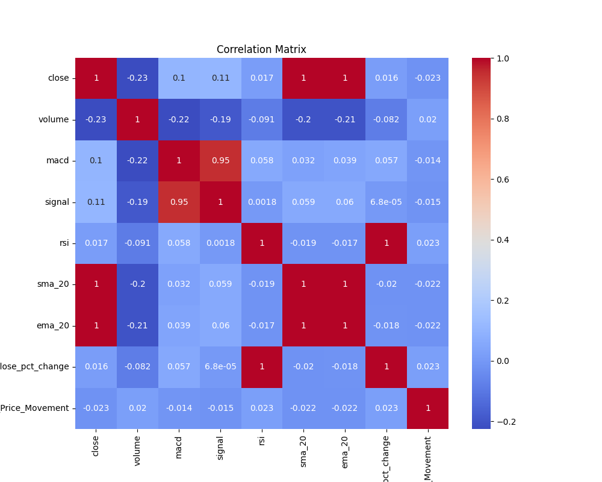
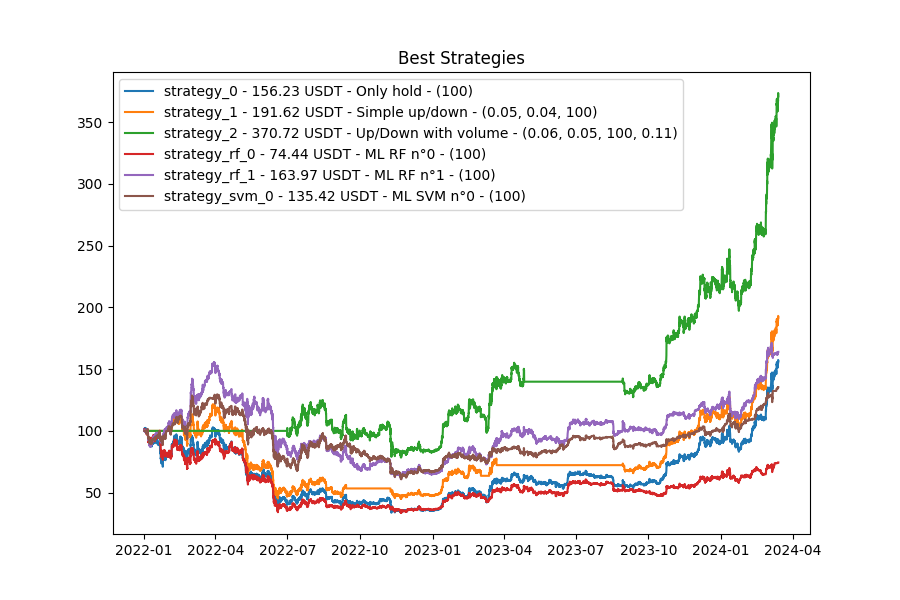

**WARNING**: This is for educational purposes only. Do not use this for real trading.

# simple_trading_tests

This is a simple trading test on BTC/USDT using extreme basic strategies.

```bash
python3 -m venv .venv
source .venv/bin/activate
pip install -r requirements.txt
python3 main.py
python3 plot_results.py
```

## Results

First of:
- All initial investments are 100 USDT.
- All showns results are for 2022-01-01 to 2024-03-13. 
- Training data and optimization is using data from 2013-01-01 to 2022-01-01.
- Candle interval is 6 hours.

### 1. Buy and Hold

The Buy and Hold strategy is the simplest strategy. It consists of buying the asset and holding it for a long period of time. In this case, we buy BTC/USDT and hold it for the entire period.

Result: 100 USDT of BTC in 2022-01-01 would be **worth 156 USDT of BTC** in 2024-03-13.

### 2. Buy and Sell based on change in price

The strategy is to buy BTC/USDT when the price changes by more than X percent and sell when the price changes by less than X percent.
When optimizing we find that best is to buy with a increase of 1% and sell with a decrease of 12%.

Result: 100 USDT of BTC in 2022-01-01 would be **worth 100 USDT of BTC** in 2024-03-13.

### 3. Buy and Sell based on change in price and volume

Same as before, but add the volume rate change.
When optimizing we find that best is to buy with a increase of 6% and sell with a decrease of 5%. Also, buy with a volume increase of 11% and sell with a volume decrease of 11%.

Result: 100 USDT of BTC in 2022-01-01 would be **worth 370 USDT of BTC** in 2024-03-13.

<!-- ### 4. Buy and Sell based on change in price and volume and MACD

Same as before, but add the MACD indicator.
When optimizing we find that best is to buy with a increase of 0.5% and sell with a decrease of %. Also, buy with a volume increase of % and sell with a volume decrease of %. Also, buy when MACD is positive and sell when MACD is negative.

Result: 100 USDT of BTC in 2022-01-01 would be **worth 100 USDT of BTC** in 2024-03-13. -->

### 5. SVM based on multiple features

#### 5.0. Feature exploration

We use the following features: ['close', 'volume', 'macd', 'close_pct_change']




#### 5.1. Feature list: ['close', 'volume', 'macd', 'close_pct_change']
Feature list: ['close', 'volume', 'macd', 'close_pct_change']

We optimize hyperparameters for the SVM model using random search. Test accuracy is 0.55.

Result: 100 USDT of BTC in 2022-01-01 would be **worth 135 USDT of BTC** in 2024-03-13.

#### 5.2. Other feature exploration

TODO

### 5. Random Forest based on multiple features

#### 5.0. Feature ['close', 'volume', 'macd', 'close_pct_change']

Result: 100 USDT of BTC in 2022-01-01 would be **worth 163 USDT of BTC** in 2024-03-13.


## Conclusion

```text
Initial Portfolio Value: 100
+-----------------+---------------------+---------------------+
| Strategy Name   | Description         | Percentage Change   |
+=================+=====================+=====================+
| strategy_2      | Up/Down with volume | 270.72%             |
+-----------------+---------------------+---------------------+
| strategy_1      | Simple up/down      | 91.62%              |
+-----------------+---------------------+---------------------+
| strategy_rf_1   | ML RF n°1           | 63.97%              |
+-----------------+---------------------+---------------------+
| strategy_0      | Only hold           | 56.23%              |
+-----------------+---------------------+---------------------+
| strategy_svm_0  | ML SVM n°0          | 35.42%              |
+-----------------+---------------------+---------------------+
| strategy_rf_0   | ML RF n°0           | -25.56%             |
+-----------------+---------------------+---------------------+
```



## Reflexions

- Just holding is globally better than trying to time the market.
- Actually, the simple strategies are not that bad: However we need at the volume to perform better than just holding.
- 